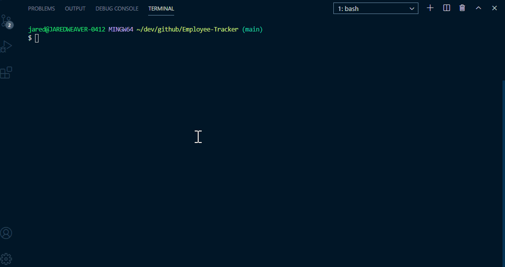

# Employee-Tracker
A command line application that builds a database for managing a company's employees using node, inquirer, and MySQL.



## User Story

```
As a business owner
I want to be able to view and manage the departments, roles, and employees in my company
So that I can organize and plan my business
```

## Task

Build a command-line application that at a minimum allows the user to:

  * Add departments, roles, employees
  * View departments, roles, employees
  * Update employee roles

Bonus points if you're able to:

  * Update employee managers
  * View employees by manager
  * Delete departments, roles, and employees
  * View the total utilized budget of a department -- ie the combined salaries of all employees in that department

## Questions

For any questions relating to this application, please reach out to me at the following:

Email: jared.weaver2@gmail.com

Github: [JaredWeaver](github.com/JaredWeaver)

